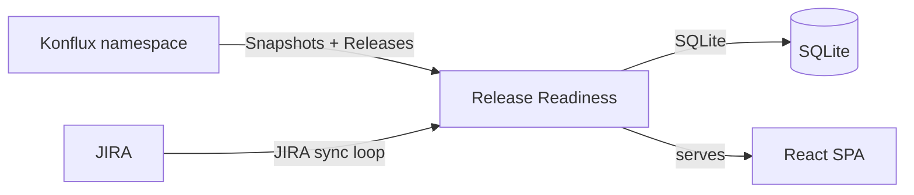

# Release Readiness Dashboard

Tracks Konflux build snapshots and releases, and JIRA issues, across Quay release versions.

## Architecture



The Go backend runs two background sync loops that pull data into a local SQLite database. The React SPA is embedded into the binary and served directly by the backend.

## Syncing

### Konflux sync (default: every 30s)

Lists `Snapshot` and `Release` resources (`appstudio.redhat.com/v1alpha1`) in the `-namespace` Konflux namespace through the Kubernetes API, using `-kubeconfig`/`KUBECONFIG` or, when unset, the in-cluster service account. New snapshots are stored with their components (git SHA, image); releases are upserted and served at `/api/v1/konflux-releases`. Each record's `created_at` is the resource's `creationTimestamp`.

Test results are not ingested.

### JIRA sync (default: every 5m)

Discovers active releases by querying for JIRA issues with the `-area/release` component that are not Closed/Done. Parses the version from the ticket summary (e.g. "Release Quay v3.16.2") and syncs all issues matching that `fixVersion` (and optionally the Target Version custom field).

## Release view

Each JIRA release maps to a Konflux application by major.minor version: fixVersion `quay-v3.16.2` (or plain `3.16.2`) maps to `quay-3-16`, and `omr-v2.0.10` to `omr-2-0`.

A Quay release's components come from three applications: `fbc-quay-X-Y` (the shipped FBC, 3.16+ only), `quay-X-Y`, and the `quay-X-Y-*` base image components of `quay-images-base`. The newest image per component across them is served at `/api/v1/releases/{version}/components`. `/api/v1/releases/{version}/snapshots` pages through the release's snapshots, newest first (`limit`, `offset`, `application`, `with_release=true`), and `/api/v1/releases/{version}/snapshots/{name}` returns one snapshot's components.

## JIRA expectations

- **Release discovery** — searches for issues where `component = "-area/release"` and status is not Closed/Done
- **Version parsing** — extracts the product and version from the ticket summary (e.g. "Release Quay v3.16.2")
- **Issue sync** — fetches all issues matching the discovered `fixVersion` (format: `{product}-v{version}`, e.g. `quay-v3.16.2`)
- **Target Version** — optionally reads a custom field (`customfield_12319940` by default) for additional version targeting

## Running the application

### Build

```bash
# Backend
go build -o release-readiness ./cmd/release-readiness/

# Frontend
cd web && npm install && npm run build
```

### CLI flags

| Flag | Env var | Default | Description |
|------|---------|---------|-------------|
| `-addr` | — | `:8080` | Listen address |
| `-db` | — | `dashboard.db` | SQLite database path |
| `-kubeconfig` | `KUBECONFIG` | — | Kubeconfig path (empty uses the in-cluster service account) |
| `-namespace` | `KONFLUX_NAMESPACE` | `art-quay-tenant` | Konflux namespace to read Snapshots and Releases from |
| `-konflux-poll-interval` | — | `30s` | Konflux sync poll interval |
| `-art-build-history-url` | — | `https://art-build-history-art-build-history.apps.artc2023.pc3z.p1.openshiftapps.com` | ART build history service; component images are looked up there in the background for build and upstream commit links (empty disables) |
| `-jira-url` | `JIRA_URL` | `https://redhat.atlassian.net` | JIRA Cloud URL |
| `-jira-email` | `JIRA_EMAIL` | — | JIRA Cloud account email for API token auth |
| `-jira-token` | `JIRA_TOKEN` | — | JIRA Cloud API token (required to enable JIRA sync) |
| `-jira-project` | `JIRA_PROJECT` | `PROJQUAY` | JIRA project key |
| `-jira-target-version-field` | `JIRA_TARGET_VERSION_FIELD` | `customfield_12319940` | JIRA custom field for Target Version |
| `-jira-poll-interval` | — | `5m` | JIRA sync poll interval |

### Local development

```bash
# Start backend (the kubeconfig needs read access to Snapshots and Releases in the namespace)
KUBECONFIG=<path> go run ./cmd/release-readiness -addr :8088 -db /tmp/rr.db

# In a separate terminal, start the Vite dev server (proxies /api to localhost:8088)
cd web && npm run dev
```

### Deployment

`deploy/rbac.yaml` creates the `release-readiness` ServiceAccount and a Role granting read-only access to Snapshots and Releases. The Role and RoleBinding must live in the Konflux namespace the app reads.

### Upgrading

The schema changed when the Konflux source moved to Kubernetes. Delete the old SQLite database file before upgrading; it is recreated on startup.
