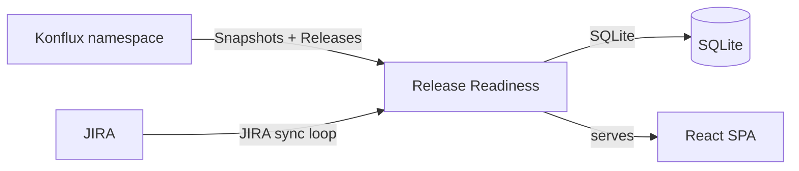

# Release Readiness Dashboard

Tracks Konflux build snapshots and releases, and JIRA issues, across Quay release versions.

## Architecture



The Go backend runs background sync loops that pull data into a local SQLite database. The React SPA is embedded into the binary and served directly by the backend.

## Syncing

### Konflux sync (default: every 30s)

Lists `Snapshot` and `Release` resources (`appstudio.redhat.com/v1alpha1`) in the `-namespace` Konflux namespace through the Kubernetes API, using `-kubeconfig`/`KUBECONFIG` or, when unset, the in-cluster service account. New snapshots are stored with their components (git SHA, image); releases are upserted and served with the snapshots they name. Each record's `created_at` is the resource's `creationTimestamp`.

Each pass also reads the file-based catalog of the newest quay-operator FBC images not yet read, pulled anonymously from the image's registry (registry v2 API), to check whether a Quay Snapshot's operator bundle is in the catalog.

Test results are not ingested.

### JIRA sync (default: every 5m)

Discovers active releases by querying for JIRA issues with the `-area/release` component that are not Closed/Done. Parses the version from the ticket summary (e.g. "Release Quay v3.16.2") and syncs all issues whose Target Version equals the release version (e.g. `quay-v3.16.2`).

### Prow sync (default: every 15m, only when jobs are configured)

Lists the runs of each `-prow-jobs` periodic in the public `test-platform-results-public` GCS bucket and stores each run's state, Prow link and, once the run has finished, the images its `tested-images.json` names. A job maps to a Konflux application, so every z-stream of a minor (`quay-v3.18.1`, `quay-v3.18.2`) shows the same runs.

A run counts as testing a Snapshot component only on an exact (role, manifest digest) match: `quay-X-Y-quay-{quay,clair,builder,builder-qemu,operator,operator-bundle}` against the matching role, and `fbc-quay-X-Y-quay-operator` against the catalog. `/api/v1/releases/{version}/snapshots/{name}/prow-runs` returns those runs per component; `/api/v1/releases/{version}/prow-runs` pages through the application's runs (`limit`, `offset`, `unlinked=true` for runs matching no Snapshot image).

### Sync status

`/api/v1/sync-status` lists each enabled sync (`konflux`, `jira`, `art-builds`, `catalog`, `fbc-catalogs`, `prow`) with its last success, and as `problems` those whose last pass failed or that have had no success within 3 poll intervals (at least 10 minutes); the header shows a warning icon while any exist.

## Release view

Each JIRA release maps to a Konflux application by major.minor version: fixVersion `quay-v3.16.2` maps to `quay-3-16`, and `omr-v2.0.10` to `omr-2-0`.

A Quay release's components come from three applications: `fbc-quay-X-Y` (the shipped FBC, 3.16+ only), `quay-X-Y`, and the `quay-X-Y-*` base image components of `quay-images-base`. `/api/v1/releases/{version}/snapshots` pages through the release's snapshots, newest first (`limit`, `offset`, `application`, `with_release=true`), and `/api/v1/releases/{version}/snapshots/{name}` returns one snapshot's components, each with any newer ART build still running (`pending_art_build`), and for a Quay snapshot whether the FBC catalog carries its operator bundle (`fbc_catalog`: `current`, `behind` or `unknown`). `/api/v1/releases/{version}/build-attempts` returns the release's ART image-build attempts, newest first, within the span ART history was read without a gap; `covered_from` and `covered_to` are null when the stream was never read.

`/api/v1/releases/{version}/staged` returns the newest Snapshot ART staged for the version's assembly (`quay-v3.18.1` is assembly `3.18.1`) of each kind, `staged_image` and `staged_fbc`, each with the newest Konflux Release that names it (`release`, null when none does). A staged Snapshot is one annotated `art.redhat.com/assembly`, `art.redhat.com/kind` (`image` or `fbc`) and `art.redhat.com/env=stage`. Each is null when ART staged none; neither claims to be the build that ships.

## JIRA expectations

- **Release discovery** — searches for issues where `component = "-area/release"` and status is not Closed/Done
- **Version parsing** — extracts the product and version from the ticket summary (e.g. "Release Quay v3.16.2")
- **Issue sync** — fetches all issues whose Target Version equals the release version (format: `{product}-v{version}`, e.g. `quay-v3.16.2`)

## Running the application

### Build

```bash
# Backend
go build -o release-readiness ./cmd/release-readiness/

# Frontend
cd web && npm install && npm run build
```

### CLI flags

| Flag | Env var | Default | Description |
|------|---------|---------|-------------|
| `-addr` | — | `:8080` | Listen address |
| `-db` | — | `dashboard.db` | SQLite database path |
| `-kubeconfig` | `KUBECONFIG` | — | Kubeconfig path (empty uses the in-cluster service account) |
| `-namespace` | `KONFLUX_NAMESPACE` | `art-quay-tenant` | Konflux namespace to read Snapshots and Releases from |
| `-konflux-poll-interval` | — | `30s` | Konflux sync poll interval |
| `-art-build-history-url` | — | `https://art-build-history-art-build-history.apps.artc2023.pc3z.p1.openshiftapps.com` | ART build history service; component images are looked up there in the background for build and upstream commit links, and each Quay stream's image-build attempts are kept (empty disables) |
| `-jira-url` | `JIRA_URL` | `https://redhat.atlassian.net` | JIRA Cloud URL |
| `-jira-api-url` | `JIRA_API_URL` | `-jira-url` | JIRA REST API base URL; set to `https://api.atlassian.com/ex/jira/<cloudId>` for scoped API tokens |
| `-jira-email` | `JIRA_EMAIL` | — | JIRA Cloud account email for API token auth |
| `-jira-token` | `JIRA_TOKEN` | — | JIRA Cloud API token (required to enable JIRA sync) |
| `-jira-project` | `JIRA_PROJECT` | `PROJQUAY` | JIRA project key |
| `-jira-poll-interval` | — | `5m` | JIRA sync poll interval |
| `-prow-jobs` | `PROW_JOBS` | — | Periodic Prow jobs to ingest, as `job_name=konflux_application[,...]`, e.g. `periodic-ci-quay-quay-redhat-3.18-aws-ocp422-e2e-install-aws-s3-nightly=quay-3-18` |
| `-prow-interval` | — | `15m` | Prow sync poll interval |
| `-catalog-url` | — | `https://catalog.redhat.com/api/containers/v1` | Red Hat container catalog API, checked hourly in the background to mark versions shipped (empty leaves JIRA's released flag as the only shipped signal) |

### Local development

```bash
# Start backend (the kubeconfig needs read access to Snapshots and Releases in the namespace)
KUBECONFIG=<path> go run ./cmd/release-readiness -addr :8088 -db /tmp/rr.db

# In a separate terminal, start the Vite dev server (proxies /api to localhost:8088)
cd web && npm run dev
```

### Deployment

`deploy/rbac.yaml` creates the `release-readiness` ServiceAccount and a Role granting read-only access to Snapshots and Releases. The Role and RoleBinding must live in the Konflux namespace the app reads.

### Upgrading

The schema changed when the Konflux source moved to Kubernetes. Delete the old SQLite database file before upgrading; it is recreated on startup.
